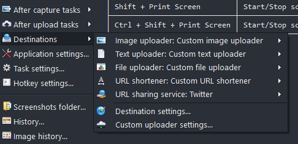

# Configuring ShareX client

To take advantage of all features of this server you need to add 3 custom configurations:
1. `Files` - it takes care of images, gifs, videos, binary files
2. `Text` - it takes care of plain-text files
3. `URL shortener` - allows to shorten any URL

Almost-ready to import ShareX configurations are provided below.

**You need to change your `RequestURL` and `ShareX-Access-Token` if you're using access token authentication!**

Files:

```json
{
  "Version": "14.1.0",
  "Name": "ShareX Server / Files",
  "DestinationType": "ImageUploader, FileUploader",
  "RequestMethod": "POST",
  "RequestURL": "http://localhost:7000/media/upload",
  "Parameters": {
    "isText": "false"
  },
  "Headers": {
    "ShareX-Access-Token": "AAA-BBB-CCC-DDD-EEE-12345"
  },
  "Body": "MultipartFormData",
  "FileFormName": "file",
  "URL": "{json:$.data.url}",
  "DeletionURL": "{json:$.data.deletionUrl}",
  "ErrorMessage": "{json:$.errorMessage}"
}
```

Text:
```json
{
  "Version": "14.1.0",
  "Name": "ShareX Server / Text",
  "DestinationType": "TextUploader",
  "RequestMethod": "POST",
  "RequestURL": "http://localhost:7000/media/upload",
  "Parameters": {
    "isText": "true"
  },
  "Headers": {
    "ShareX-Access-Token": "AAA-BBB-CCC-DDD-EEE-12345"
  },
  "Body": "MultipartFormData",
  "FileFormName": "file",
  "URL": "{json:$.data.url}",
  "DeletionURL": "{json:$.data.deletionUrl}",
  "ErrorMessage": "{json:$.errorMessage}"
}
```

URL shortener:
```json
{
  "Version": "14.1.0",
  "Name": "ShareX Server / URL shortener",
  "DestinationType": "URLShortener",
  "RequestMethod": "POST",
  "RequestURL": "http://localhost:7000/url/shorten",
  "Headers": {
    "ShareX-Access-Token": "AAA-BBB-CCC-DDD-EEE-12345"
  },
  "Body": "MultipartFormData",
  "Arguments": {
    "realUrl": "{input}"
  },
  "URL": "{json:$.data.realUrl}",
  "ErrorMessage": "{json:$.errorMessage}"
}
```

Then you need to set your custom configurations as target upload servers:



And.. you should be done! ✨